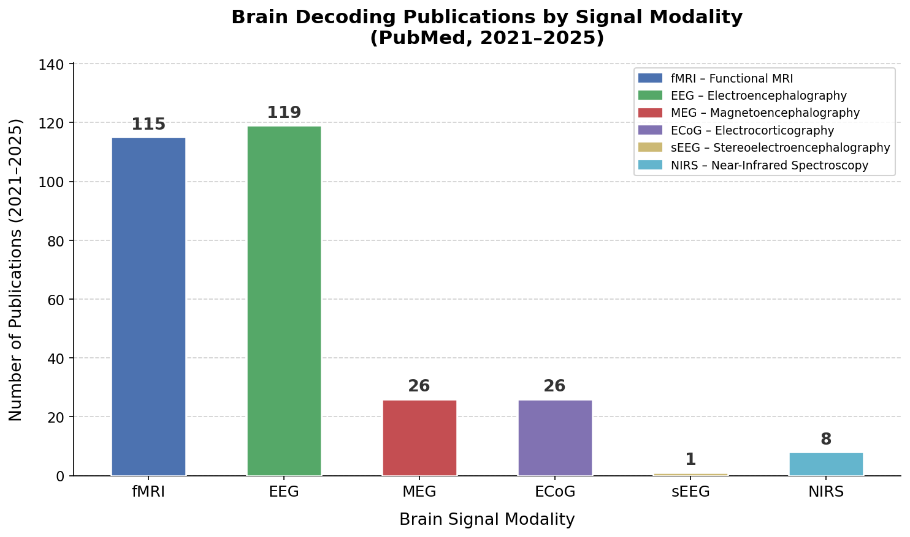

# 🧠 Brain-Decoding-Guide

> 📚 This repo aims to guide researchers who are new to the **Brain Decoding** field to quickly learn about its techniques, datasets, and applications.

---

## 📖 Table of Contents

[Introduction](#-introduction) · [Modalities](#-brain-signal-modalities) · [Datasets](#-datasets) · [Surveys](#-key-surveys) · [Foundational Works](#-foundational-works-pre-2023) · [Recent Advances](#️-recent-advances--core-algorithms) · [Metrics & Tools](#-metrics--tools) · [Clinical Cases](#-clinical-application-cases) · [Learning Resources](#-learning-resources) · [Contributing](#-contributing)

---

## 📌 Introduction

**Brain decoding** (also referred to as neural decoding) is a computational and neuroscientific technique that extracts meaningful, interpretable information about an individual's **subjective mental states**, **perceptual experiences**, **cognitive processes**, or **behavioral intentions** directly from recorded brain activity (e.g., **fMRI, EEG, MEG, or invasive neural recordings**). It relies on machine learning algorithms, statistical modeling, and neuroscientific insights to map patterns of neural activity to specific mental content, with applications in neuroscience research, brain-computer interfaces (BCIs), and clinical neuroscience.

---

## 🧬 Brain Signal Modalities

| Modality | Full Name | Spatial Res. | Temporal Res. | Invasiveness | Common Use Cases |
|----------|-----------|--------------|---------------|--------------|------------------|
| **fMRI** | Functional Magnetic Resonance Imaging | ~1-3 mm | ~1-2 s | Non-invasive | Visual/Semantic decoding |
| **EEG** | Electroencephalography | ~10 mm | ~1 ms | Non-invasive | Motor imagery, emotion, sleep |
| **MEG** | Magnetoencephalography | ~5 mm | ~1 ms | Non-invasive | Language, auditory processing |
| **ECoG** | Electrocorticography | ~1 cm | ~1 ms | Invasive | Speech BCI, epilepsy |
| **sEEG** | Stereoelectroencephalography | ~5 mm | ~1 ms | Invasive | Deep brain structures |
| **NIRS** | Near-Infrared Spectroscopy | ~10 mm | ~100 ms | Non-invasive | Portable BCI, infants |

> 💡 **Tip**: fMRI excels at *where* (spatial), while EEG/MEG excel at *when* (temporal). Invasive methods (ECoG, sEEG) offer the best of both but require surgery.

---

## 📊 Datasets

<strong>📂 fMRI Datasets (click to expand)</strong>

| Task | Dataset | Signal | Description | Links |
|------|---------|--------|-------------|-------|
| Disease Classification | **ABIDE-I** | fMRI | 1035 subjects (~111.8 hours); autism detection & gender classification | [website](https://fcon_1000.projects.nitrc.org/indi/abide/) |
| Disease Classification | **ADHD200** | fMRI | 973 subjects (~129.5 hours); ADHD diagnosis | [website](https://fcon_1000.projects.nitrc.org/indi/adhd200/) |
| Visual Image Decoding | **NSD (2021)** | fMRI | 7 subjects viewing ~70,000 natural images (~1.5–2TB, application required) | [website](https://registry.opendata.aws/nsd/) |
| Visual Image Decoding | **BOLD5000 (2021)** | fMRI | 4 subjects viewing ~5,000 COCO/ImageNet/SUN images (~150–200GB) | [website](https://bold5000-dataset.github.io/website/download.html) |
| Visual Image Decoding | **GOD (2019)** | fMRI | 5 subjects viewing object categories; generic object decoding (~5–10GB) | [website](https://github.com/KamitaniLab/GenericObjectDecoding) |
| Visual Image Decoding | **THINGS fMRI1** | fMRI | 3 subjects, 8,640 object images; object recognition & representational geometry | [website](https://things-initiative.org/) |
| Visual Image Decoding | **vim-1 (2011)** | fMRI | 1–2 subjects viewing natural images; visual encoding/decoding (~10GB) | [website](https://crcns.org/data-sets/vc/vim-1/about-vim-1) |
| Video Perception Decoding | **Algonauts (2021/2023)** | fMRI | 10–30 subjects watching short natural videos; brain encoding challenge (~50–150GB) | [website](https://algonautsproject.com/index.html) |
| Multi-task / Resting-State | **Human Connectome Project** | fMRI | 1200 subjects; multi-task & resting-state fMRI (~80–100TB) | [website](https://hub.datalad.org/hcp-openaccess/hcp1200-functional-connectivity) |
| Video Perception Decoding | **CC2017 (2017)** | fMRI | 3 subjects watching ~3 hours of videos; video brain encoding (~30–40GB) | [website](https://purr.purdue.edu/publications/2809/1) |
| Video Perception Decoding | **BOLD Moments Dataset** | fMRI | 10 subjects watching 1,102 short videos; dynamic visual encoding (~88GB) | [website](https://github.com/blahner/BOLDMomentsDataset) |
| Video Perception Decoding | **vim-2 (2014)** | fMRI | 3 subjects watching natural videos; visual motion encoding (~50–100GB) | [website](https://crcns.org/data-sets/vc/vim-2/about-vim-2) |
| Facial Expression Decoding | **NFED (2024)** | fMRI | 5 subjects watching ~1320 facial expression videos (~176GB) | [website](https://openneuro.org/datasets/ds005047) |
| 3D Object Decoding | **fMRI-Shape** | fMRI | 14 subjects viewing 1600+ 3D objects; 3D shape perception decoding | [website](https://huggingface.co/datasets/Fudan-fMRI/fMRI-Shape) |
| 3D Object Decoding | **fMRI-Objaverse** | fMRI | 5 subjects viewing 3,142 3D objects across 117 categories | [website](https://huggingface.co/datasets/Fudan-fMRI/fMRI-Objaverse) |
| Auditory Language Decoding | **Narratives (2011–2018)** | fMRI | 345 subjects listening to 28 spoken stories; semantic mapping (~132GB) | [website](https://openneuro.org/datasets/ds002345) |
| Auditory Language Decoding | **Nature Story Listening (2016)** | fMRI | 11 subjects listening to long-form stories; continuous language encoding | [website](https://gin.g-node.org/gallantlab/story_listening) |
| Language Comprehension | **MOUS-fMRI** | fMRI | 200+ subjects reading or listening to sentences (well-formed vs scrambled) | [website](https://data.ru.nl/collections/di/dccn/DSC_3011020.09_236) |
| Language Decoding | **Semantic Listening vs Reading** | fMRI | fMRI during reading and listening to natural stories; modality comparison | [website](https://gin.g-node.org/denizenslab/narratives_reading_listening_fmri) |

<strong>📂 EEG Datasets (click to expand)</strong>

| Task | Dataset | Signal | Description | Links |
|------|---------|--------|-------------|-------|
| Alzheimer's / FTD Classification | **OpenNeuro AD/FTD Dataset** | EEG | 36 AD + 23 FTD patients (~14.9 hours EEG) | [website](https://github.com/OpenNeuroDatasets/ds004504) |
| Depression Detection | **Mumtaz2016** | EEG | 35 subjects (~20.3 hours EEG) for MDD detection | [website](https://figshare.com/articles/dataset/EEG_Data_New/4244171/2) |
| Mental Disorder Classification | **MODMA** | EEG + Speech | Multimodal mental disorder EEG (128+3 channels) and speech | [website](https://modma.lzu.edu.cn/) |
| Seizure Detection | **SienaScalpEEGDatabase** | EEG | Clinical scalp EEG dataset with seizure annotations | [website](https://physionet.org/content/siena-scalp-eeg/1.0.0/) |
| Seizure Detection | **CHB-MIT** | EEG | 20 pediatric subjects with epilepsy EEG (~40GB) | [website](https://physionet.org/content/chbmit/1.0.0/) |
| Parkinson's Detection | **PD31** | EEG | 31 subjects (~2.5 hours EEG) for Parkinson's detection | [website](https://openneuro.org/datasets/ds002778/versions/1.0.5) |
| Abnormal EEG Classification | **TUAB** | EEG | 2000+ subjects, 1000+ hours EEG (application required) | [website](https://isip.piconepress.com/projects/nedc/html/tuh_eeg/) |
| Visual Image Decoding | **THINGS-EEG1 (2022)** | EEG | 50 subjects viewing object images; object-level representation (~40GB) | [website](https://things-initiative.org/) |
| Visual Image Decoding | **THINGS-EEG2 (2025)** | EEG | 10 subjects viewing 16,740 images; visual decoding & reconstruction | [website](https://osf.io/user/6jt4f) |
| Visual Image Decoding | **Kaneshiro2015** | EEG | 10 subjects viewing 72 object images; representational geometry | [website](https://purl.stanford.edu/bq914sc3730) |
| Visual Image Decoding | **Grootswagers2019** | EEG | 16 subjects viewing 200 images; rapid visual categorization | [website](https://osf.io/a7knv/overview) |
| Visual Image Decoding | **ImageNet-EEG** | EEG | 16 subjects with 87,850 EEG-image pairs; image reconstruction (~18GB) | [website](https://github.com/Promise-Z5Q2SQ/EEG-ImageNet-Dataset) |
| Emotion Recognition | **MAHNOB-HCI** | EEG + Video | 30 subjects watching emotional videos (partially unavailable) | [website](https://mahnob-db.eu) |
| Emotion Recognition | **SEED-DV** | EEG | 15 subjects watching emotional videos; dynamic emotion recognition | [website](https://bcmi.sjtu.edu.cn/home/seed/index.html) |
| Language / Reading Decoding | **ZuCo (2018)** | EEG + Eye-tracking | 12 subjects reading text; EEG-to-text decoding (~5–10GB) | [website](https://osf.io/q3zws) |
| Imagined Speech Decoding | **Inner Speech Dataset** | EEG | 10 subjects (~9 hours EEG) for imagined speech decoding | [website](https://github.com/N-Nieto/Inner_Speech_Dataset) |
| Language / Reading Decoding | **ChineseEEG-2** | EEG | 12 subjects performing Chinese reading tasks (~100GB) | [website](https://github.com/ncclab-sustech/ChineseEEG-2) |
| Auditory Language Decoding | **Broderick2018** | EEG | 19 subjects listening to natural speech; auditory attention decoding | [website](https://datadryad.org/dataset/doi:10.5061/dryad.070jc) |
| Imagined Speech Decoding | **Chisco** | EEG | >20k high-density EEG samples for imagined speech | [website](https://github.com/zhangzihan-is-good/Chisco) |
| Auditory Language Decoding | **Brennan-Hale2019** | EEG | 33 subjects listening to English speech; neural tracking | [website](https://deepblue.lib.umich.edu/data/concern/data_sets/bn999738r) |
| Imagined Speech Decoding | **BCIC2020-3** | EEG | 15 subjects, 64-channel EEG, 5-class imagined speech | [website](https://www.kaggle.com/datasets/abdulkareembageri/imagined-speech-eeg-signal-bci2020) |
| Imagined Speech Decoding | **KARA ONE** | EEG | 12 subjects imagined speech dataset (~24GB) | [website](https://www.cs.toronto.edu/~complingweb/data/karaOne/karaOne.html) |
| EEG Event Classification | **TUEV** | EEG | ~150 hours EEG with event annotations | [website](https://isip.piconepress.com/projects/nedc/html/tuh_eeg/) |
| Motor Imagery Classification | **WBCIC_SHU** | EEG | 51 subjects (~34 hours) motor imagery EEG | [website](https://figshare.com/articles/dataset/Brain_Computer_Interface_Motor_Imagery-EEG_Dataset/22671172) |
| Motor Imagery Classification | **PhysioNet-MI** | EEG | 109 subjects (~10.9 hours) motor imagery EEG | [website](https://physionet.org/content/eegmmidb/) |
| Motor Imagery Classification | **BCIC-IV-2a** | EEG | 9 subjects, 22-channel EEG, 4-class motor imagery | [website](https://www.bbci.de/competition/iv/#datasets) |
| Cognitive Load / Stress | **MentalArithmetic** | EEG | 36 subjects performing arithmetic tasks for stress classification | [website](https://physionet.org/content/eegmat/1.0.0/) |
| Emotion Recognition | **SEED (2013)** | EEG | 15 subjects; 3-class emotion recognition (application required) | [website](https://bcmi.sjtu.edu.cn/home/seed/index.html) |
| Sleep Stage Classification | **Sleep-EDF (2013)** | EEG | 22 subjects overnight sleep EEG; 5-stage sleep classification (~8.1GB) | [website](https://physionet.org/content/sleep-edfx/1.0.0/) |
| Sleep Stage Classification | **ISRUC** | EEG | 100 subjects sleep EEG with 5-stage classification | [website](https://sleeptight.isr.uc.pt/) |
| Multi-task BCI | **MOABB** | EEG | Benchmark platform integrating 30+ pipelines and 36+ EEG datasets | [website](https://moabb.neurotechx.com/) |

<strong>📂 MEG Datasets (click to expand)</strong>

| Task | Dataset | Signal | Description | Links |
|------|---------|--------|-------------|-------|
| Multi-task / Lifespan | **Cam-CAN MEG** | MEG | Hundreds of subjects across lifespan; perception, memory, motor (application required) | [website](https://camcan-archive.mrc-cbu.cam.ac.uk) |
| Visual Image Decoding | **THINGS MEG1** | MEG | 4 subjects, 22,248 image trials; object recognition & representational similarity | [website](https://things-initiative.org/) |
| Language Comprehension | **MOUS-MEG** | MEG | 200+ subjects reading or listening to sentences (well-formed vs scrambled) | [website](https://data.ru.nl/collections/di/dccn/DSC_3011020.09_236) |
| Auditory Language Decoding | **MEG-MASC** | MEG | 27 subjects listening to speech stimuli; speech neural tracking | [website](https://osf.io/ag3kj/overview) |
| Clinical Neuroimaging | **OMEGA** | MEG | 444 controls + 200 patients (>150 hours); clinical MEG repository | [website](https://www.mcgill.ca/bic/neuroinformatics/omega) |
| Multi-task | **HCP-MEG** | MEG | MEG subset of HCP with motor, story, working memory tasks | [website](https://neuroimage.usc.edu/brainstorm/Tutorials/HCP-MEG) |

<strong>📂 ECoG / SEEG / MEA Datasets (click to expand)</strong>

| Task | Dataset | Signal | Description | Links |
|------|---------|--------|-------------|-------|
| Audiovisual Perception | **CRCNS ECoG** | ECoG | 21 epilepsy patients performing audiovisual tasks (~8GB) | [website](https://deepblue.lib.umich.edu/data/concern/data_sets/4f16c309z) |
| Speech Decoding / BCI | **Metzger2023** | ECoG | Single-subject speech neuroprosthesis ECoG dataset | [website](https://zenodo.org/records/8200782) |
| Language / Reading Decoding | **Verwoert2022** | sEEG | 54–127 epilepsy patients performing reading tasks | [website](https://osf.io/nrgx6/overview) |
| Speech Decoding / BCI | **Willett2023** | MEA (intracortical) | Neural recordings for speech prosthesis with 12,100 spoken sentences | [website](https://datadryad.org/dataset/doi:10.5061/dryad.x69p8czpq) |

<strong>📂 Multimodal Datasets (click to expand)</strong>

| Task | Dataset | Signal | Description | Links |
|------|---------|--------|-------------|-------|
| Motor Imagery / Decoding | **SomatoMotor** | EEG + MEG | 5 subjects (~0.7 hours) EEG+MEG motor task dataset | [website](https://openneuro.org/datasets/ds006035/versions/1.0.0) |
| Video / Multimodal Perception | **CineBrain** | EEG + fMRI | 6 subjects (~6 hours) multimodal dataset with video stimuli | [website](https://huggingface.co/datasets/Fudan-fMRI/CineBrain) |
| Resting-State / Connectivity | **LEMON** | EEG + fMRI | 220 subjects (~39.6 hours) resting-state EEG+fMRI dataset | [website](https://fcon_1000.projects.nitrc.org/indi/retro/MPI_LEMON.html) |
| Natural Viewing / Visual Encoding | **Nat-View** | EEG + fMRI | 22 subjects (~42.8 hours) natural viewing EEG+fMRI dataset | [website](https://openneuro.org/datasets/ds003688) |
| Language Comprehension | **SMN4Lang** | MEG + fMRI | 12 subjects (~70.4 hours) multimodal language dataset | [website](https://openneuro.org/datasets/ds004078/versions/1.2.1) |
| Multi-task BCI | **L-mind** | EEG + fNIRS + PPG | 12 subjects multimodal dataset with 23,928 instruction-based samples | [website](https://huggingface.co/datasets/Lance1573/L-Mind) |
| Sleep Stage Classification | **CAP** | EEG + EOG + EMG | Sleep dataset with CAP annotations including normal and pathological recordings | [website](https://physionet.org/content/capslpdb/1.0.0/) |
| Sleep Stage Classification | **MASS** | EEG + EOG + EMG | Large-scale multimodal sleep dataset with 200+ subjects | [website](http://ceams-carsm.ca/mass/) |

---

## 📑 Key Surveys

| Year | Title | Venue | Highlights |
|------|-------|-------|------------|
| 2025 | [A Survey on fMRI-based Brain Decoding for Reconstructing Multimodal Stimuli](https://arxiv.org/abs/2503.15978) | TPAMI | Dataset/ROI summaries, model taxonomy (end-to-end, pre-trained, LLM-centric) |
| 2025 | [Deep Neural Networks and Brain Alignment: Brain Encoding and Decoding](https://openreview.net/forum?id=YxKJihRcby) | TMLR | Encoding + decoding, DL-brain alignment [[Code]](https://github.com/subbareddy248/Awesome-Brain-Encoding--Decoding) |
| 2025 | [Transformer-based EEG Decoding: A Survey](https://arxiv.org/abs/2507.02320) | ArXiv | 200+ papers on Transformer for EEG (2019-2024) |
| 2025 | [Brain Foundation Models: A Survey](https://arxiv.org/abs/2503.00580) | ArXiv | Foundation models for neural signals, pre-training paradigms |
| 2024 | [Deep Representation Learning for EEG-based BCIs: A Review](https://arxiv.org/abs/2405.19345) | ArXiv | Autoencoders, SSL, foundation models for EEG |
| 2022 | [fMRI Brain Decoding and Its Applications in BCI: A Survey](https://pubmed.ncbi.nlm.nih.gov/35203991/) | Brain | Classic ML to deep learning evolution |

---

## 📜 Foundational Works (Pre-2023)

> Milestone papers that established the field.

| Year | Title | Task | Feature | Links |
|------|-------|------|---------|-------|
| 2016 | [Natural Speech Reveals the Semantic Maps that Tile Human Cerebral Cortex](https://www.nature.com/articles/nature17637) | Semantic | Cortical semantic atlas | |
| 2017 | [Deep Learning with Convolutional Neural Networks for EEG Decoding and Visualization](https://onlinelibrary.wiley.com/doi/10.1002/hbm.23730) | Motor | Interpretable filters | [[Code]](https://github.com/braindecode/braindecode) |
| 2018 | [EEGNet: A Compact Convolutional Neural Network for EEG-based BCIs](https://iopscience.iop.org/article/10.1088/1741-2552/aace8c) | Motor | BCI baseline | [[Code]](https://github.com/vlawhern/arl-eegmodels) |
| 2019 | [Deep Image Reconstruction from Human Brain Activity](https://journals.plos.org/ploscompbiol/article?id=10.1371/journal.pcbi.1006633) | Visual | Feature optimization | |

---

## ⚙️ Recent Advances & Core Algorithms

> High-impact papers from 2023-2025.

Modern brain decoding systems are built on three complementary AI stacks: an **Encoder Stack** that learns neural representations via self-supervised pretraining (MAE, contrastive learning) and aligns them to shared cross-modal embedding spaces; a **Decoder Stack** that reconstructs stimuli using conditioned diffusion models or autoregressive transformers with brain-signal serialization; and a **"Unified" Stack** of brain foundation models that integrate spatio-temporal transformers, cross-modal knowledge distillation, and parameter-efficient fine-tuning (LoRA/PEFT) for generalizable, multi-subject decoding.

*Figure: Core AI Technology Stack System for Brain Decoding — covering the Encoder Stack (neural representation & cross-modal alignment), Decoder Stack (generative decoding & reconstruction), and the Unified Stack (brain foundation models & multimodal fusion).*

### 🖼️ Visual Reconstruction

<strong>📂 fMRI → Image (click to expand)</strong>

| Year | Title | Arch | Feature | Links |
|------|-------|------|---------|-------|
| 2023 | [High-Resolution Image Reconstruction with Latent Diffusion Models from Human Brain Activity](https://openaccess.thecvf.com/content/CVPR2023/html/Takagi_High-Resolution_Image_Reconstruction_With_Latent_Diffusion_Models_From_Human_Brain_CVPR_2023_paper.html) | `Diffusion` | Direct fMRI-to-LDM mapping without fine-tuning | [[Code]](https://github.com/yu-takagi/StableDiffusionReconstruction) |
| 2023 | [Seeing Beyond the Brain: MinD-Vis](https://arxiv.org/abs/2211.06956) | `Diffusion` | Large-scale resting-state fMRI pre-training + sparse coding | [[Code]](https://github.com/zjc062/mind-vis) |
| 2023 | [Brain-Diffuser: Natural Scene Reconstruction from fMRI Signals](https://www.nature.com/articles/s41598-023-42891-8) | `Diffusion` | VDVAE low-level + CLIP/BLIP high-level dual-pipeline reconstruction | [[Code]](https://github.com/ozcelikfu/brain-diffuser) |
| 2023 | [Reconstructing the Mind's Eye: MindEye](https://arxiv.org/abs/2305.18274) | `Diffusion` | Dual-path: contrastive retrieval + diffusion prior | [[Code]](https://github.com/MedARC-AI/fmri-reconstruction-nsd) |
| 2023 | [UniBrain: Unify Image Reconstruction and Captioning from Human Brain Activity](https://arxiv.org/abs/2308.07428) | `Diffusion` | First unified fMRI-to-image + captioning in a single LDM model | |
| 2024 | [MindEye2: Shared-Subject Models Enable fMRI-to-Image with 1 Hour of Data](https://arxiv.org/abs/2403.11207) | `Diffusion` | Cross-subject transfer via functional alignment; only 1hr data needed | [[Code]](https://github.com/MedARC-AI/MindEyeV2) [[Website]](https://medarc-ai.github.io/mindeye2/) |
| 2024 | [MindBridge: A Cross-Subject Brain Decoding Framework](https://arxiv.org/abs/2404.07850) | `Diffusion` | Single model for multi-subject; bio-inspired aggregation | [[Code]](https://github.com/littlepure2333/MindBridge) |

<strong>📂 EEG → Image (click to expand)</strong>

| Year | Title | Arch | Feature | Links |
|------|-------|------|---------|-------|
| 2024 | [DreamDiffusion: Generating High-Quality Images from Brain EEG Signals](https://arxiv.org/abs/2306.16934) | `Diffusion` | Temporal masking pre-train + CLIP alignment; first EEG-to-image | [[Code]](https://github.com/bbaaii/DreamDiffusion) |
| 2024 | [Visual Decoding and Reconstruction via EEG Embeddings with Guided Diffusion (ATM)](https://arxiv.org/abs/2403.07721) | `Diffusion` | Adaptive Thinking Mapper (ATM) encoder; zero-shot cross-subject reconstruction | [[Code]](https://github.com/dongyangli-del/EEG_Image_decode) |

<strong>📂 EEG → Video (click to expand)</strong>

| Year | Title | Arch | Feature | Links |
|------|-------|------|---------|-------|
| 2024 | [EEG2Video: Towards Decoding Dynamic Visual Perception from EEG Signals](https://arxiv.org/abs/2410.07297) | `Diffusion` | Seq2Seq EEG encoder; first EEG-to-video reconstruction; 79.8% semantic accuracy | [[Code]](https://github.com/XuanhaoLiu/EEG2Video) |

<strong>📂 fMRI → Video (click to expand)</strong>

| Year | Title | Arch | Feature | Links |
|------|-------|------|---------|-------|
| 2023 | [Cinematic Mindscapes: High-Quality Video Reconstruction from Brain Activity](https://arxiv.org/abs/2305.11675) | `Diffusion` | Spatiotemporal attention + contrastive learning; arbitrary frame-rate | [[Code]](https://github.com/jqin4749/MindVideo) [[Website]](https://www.mind-video.com) |
| 2025 | [Animate Your Thoughts: Reconstruction of Dynamic Natural Vision from Human Brain Activity](https://openreview.net/forum?id=BpfsxFqhGa) | `Diffusion` | Decouple fMRI signals into semantic, structural, and motion features, then decode them to each frame of synthesized GIFs | [[Code]](https://github.com/ReedOnePeck/MindAnimator) |

---

### 🗣️ Speech & Language Decoding

<strong>📂 Invasive Speech — ECoG / Intracortical (click to expand)</strong>

| Year | Title | Arch | Feature | Links |
|------|-------|------|---------|-------|
| 2023 | [A High-Performance Speech Neuroprosthesis](https://www.nature.com/articles/s41586-023-06377-x) | `RNN` | 62 wpm; first large-vocab decoding (125k words) | [[Code]](https://github.com/fwillett/speechBCI) |
| 2023 | [A High-Performance Neuroprosthesis for Speech Decoding and Avatar Control](https://www.nature.com/articles/s41586-023-06443-4) | `RNN` | Real-time avatar control with facial expression + speech | |
| 2025 | [A Streaming Brain-to-Voice Neuroprosthesis](https://www.nature.com/articles/s41593-025-01905-6) | `RNN-Transducer` | 80ms streaming decoding; real-time speech synthesis | [[Code]](https://github.com/cheoljun95/streaming.braindecoder) |

<strong>📂 Non-invasive Semantic — fMRI / EEG / MEG (click to expand)</strong>

| Year | Title | Arch | Feature | Links |
|------|-------|------|---------|-------|
| 2023 | [Semantic Reconstruction of Continuous Language from Non-invasive Brain Recordings](https://www.nature.com/articles/s41593-023-01304-9) | `Transformer` | GPT autoregressive decoding + beam search; multi-cortex support | |
| 2024 | [DeWave: Discrete EEG Waves Encoding for Brain Dynamics to Text Translation](https://arxiv.org/abs/2309.14030) | `Transformer` | Discrete codebook alignment to LLM; no word-level gaze annotation | |
| 2025 | [Decoding Individual Words from Non-invasive Brain Recordings (EEG/MEG)](https://www.nature.com/articles/s41467-025-65499-0) | `Transformer` | Deep learning pipeline decoding individual words from EEG and MEG signals | |

---

### 🎯 Motor & Intention Decoding

<strong>📂 Motor Imagery Papers (click to expand)</strong>

| Year | Title | Arch | Feature | Links |
|------|-------|------|---------|-------|
| 2024 | [CTNet: A Convolutional Transformer Network for EEG-based Motor Imagery Classification](https://www.nature.com/articles/s41598-024-71118-7) | `CNN-Transformer` | CNN local features + Transformer global dependencies | |
| 2023 | [EEG Conformer: Convolutional Transformer for EEG Decoding and Visualization](https://ieeexplore.ieee.org/document/9991178) | `Conformer` | Conv + self-attention; CAM-based topographic visualization | [[Code]](https://github.com/eeyhsong/EEG-Conformer) |
| 2022 | [ATCNet: Attention Temporal Convolutional Network for EEG-based Motor Imagery Classification](https://ieeexplore.ieee.org/document/9852687) | `TCN` | Sliding window + multi-head attention + TCN residual | [[Code]](https://github.com/Altaheri/EEG-ATCNet) |

---

### 🧩 Brain Foundation Models

<strong>📂 Foundation Model Papers (click to expand)</strong>

| Year | Title | Arch | Feature | Links |
|------|-------|------|---------|-------|
| 2024 | [LaBraM: Large Brain Model for Learning Generic Representations with Tremendous EEG Data](https://arxiv.org/abs/2405.18765) | `Transformer` | Pre-trained on ~2,500 hours EEG across 20+ datasets; vector-quantized neural spectrum prediction | [[Code]](https://github.com/935963004/LaBraM) |
| 2023 | [BRANT: Foundation Model for Intracortical Neural Signal](https://proceedings.neurips.cc/paper_files/paper/2023/hash/fdcb46d6ccd3d4b86a6ad4cc598b08a7-Abstract-Conference.html) | `Transformer` | Spatiotemporal Transformer pre-trained on large-scale intracortical data | |

---

## 📏 Metrics & Tools

### Evaluation Metrics

| Category | Metric | Description |
|----------|--------|-------------|
| **Encoding** | Pearson r, R² | Correlation between predicted and actual brain activity |
| **Low-level Reconstruction** | PixCorr, SSIM, PSNR | Pixel-level similarity |
| **High-level Reconstruction** | CLIP Score, Inception Score | Semantic/perceptual similarity |
| **Classification** | Accuracy, F1, AUC | Standard classification metrics |
| **Retrieval** | Top-k Accuracy, MRR | Retrieval-based evaluation |

### Software & Libraries

| Tool | Description | Link |
|------|-------------|------|
| **MNE-Python** | MEG, EEG, sEEG, ECoG, NIRS analysis | [[Website]](https://mne.tools/) [[GitHub]](https://github.com/mne-tools/mne-python) |
| **Nilearn** | Statistical learning on fMRI data | [[Website]](https://nilearn.github.io/) [[GitHub]](https://github.com/nilearn/nilearn) |
| **Braindecode** | Deep learning for EEG/ECoG/MEG decoding; EEGNet, ShallowNet, etc. | [[Website]](https://braindecode.org/) [[GitHub]](https://github.com/braindecode/braindecode) |
| **TorchEEG** | PyTorch library for EEG processing & models | [[GitHub]](https://github.com/torcheeg/torcheeg) |
| **Net2Brain** | Compare DNN activations with brain activity (RSA, encoding) | [[GitHub]](https://github.com/cvai-roig-lab/Net2Brain) |
| **Neural_Decoding** | Classic + DL decoders (Kalman, Wiener, LSTM, etc.) | [[GitHub]](https://github.com/KordingLab/Neural_Decoding) |
| **PyCortex** | fMRI visualization on cortical surface | [[GitHub]](https://github.com/gallantlab/pycortex) |
| **RSA Toolbox** | Representational Similarity Analysis | [[GitHub]](https://github.com/rsagroup/rsatoolbox) |

### Benchmark Platforms

| Platform | Description | Link |
|----------|-------------|------|
| **Algonauts Project** | Annual challenge for predicting brain responses to visual stimuli | [[Website]](http://algonauts.csail.mit.edu/) |
| **Brain-Score** | Benchmark for comparing DNNs with primate visual cortex | [[Website]](https://www.brain-score.org/) [[GitHub]](https://github.com/brain-score/brain-score) |
| **MOABB** | Mother of All BCI Benchmarks; 36 EEG datasets, 30 pipelines | [[Website]](https://moabb.neurotechx.com/) [[GitHub]](https://github.com/NeuroTechX/moabb) |

---

## 🏥 Clinical Application Cases

> Recent breakthroughs demonstrating real-world clinical impact.

| Case | Year | Description | Links |
|------|------|-------------|-------|
| **Synchron & Apple: Thought-Controlled iPad** | 2025 | ALS patient controlled iPad via Stentrode implant + Apple BCI HID protocol—navigating apps, composing texts using only thoughts | [[News]](https://www.businesswire.com/news/home/20250804537175/en/Synchron-Debuts-First-Thought-Controlled-iPad-Experience-Using-Apples-New-BCI-Human-Interface-Device-Protocol) [[Video]](https://www.youtube.com/watch?v=YK8r5vdpozA) |
| **Neuralink Telepathy** | 2024 | First Neuralink human implant; quadriplegic patient played chess & Civilization VI via cursor control using thoughts alone | [[News]](https://neuralink.com/blog/) [[Video]](https://www.youtube.com/watch?v=2rXrGH52aoM) |
| **UC Davis ALS Speech BCI** | 2024 | Restored speech for ALS patient with >97% accuracy; preserved voice identity using high-density ECoG | [[Press]](https://health.ucdavis.edu/news/headlines/new-brain-computer-interface-allows-man-with-als-to-speak-again/2024/08) [[Paper]](https://www.nejm.org/doi/full/10.1056/NEJMoa2314132) |

---

## 📚 Learning Resources

### 📺 Video Tutorials & Courses

<strong>📂 Video Tutorials (click to expand)</strong>

| Resource | Description | Link |
|----------|-------------|------|
| **Neuromatch Academy** | World-class open course on computational neuroscience; encoding/decoding basics | [[Website]](https://neuromatch.io/) [[YouTube]](https://www.youtube.com/@neuaboratory) [[Bilibili]](https://search.bilibili.com/all?keyword=Neuromatch) |
| **INCF: Deep Learning in Neuroscience** | Beginner-level DL for neuroscience applications | [[Website]](https://training.incf.org/lesson/fundamentals-deep-learning-neuroscience) |

### 📖 Textbooks & Reading

<strong>📂 Textbooks & Reading (click to expand)</strong>

| Resource | Description | Link |
|----------|-------------|------|
| **Deep Learning (Goodfellow et al.)** | Deep learning bible; free online | [[Website]](https://www.deeplearningbook.org/) |
| **Awesome-Brain-Encoding-Decoding** | Curated paper list | [[GitHub]](https://github.com/subbareddy248/Awesome-Brain-Encoding--Decoding) |

### 🌐 Communities

<strong>📂 Communities (click to expand)</strong>

| Community | Description | Link |
|-----------|-------------|------|
| **NeuroAI WeChat Group** | Chinese community for brain + AI research | Contact via WeChat number `MobiusAI` |
| **BCI Society** | International BCI research community | [[Website]](https://bcisociety.org/) |
| **OHBM** | Organization for Human Brain Mapping | [[Website]](https://www.humanbrainmapping.org/) |

---

## 🤝 Contributing

Contributions are welcome! Please feel free to submit a Pull Request. See [CONTRIBUTING.md](CONTRIBUTING.md) for guidelines.

---

**If you find this guide helpful, please consider giving it a ⭐!**

